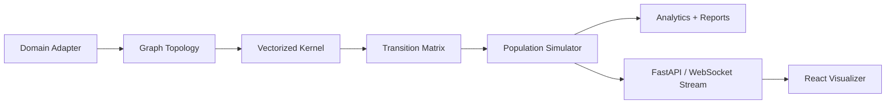

<p align="center">
  
</p>

# Dynamic Kernel

Simulation platform for non-stationary routing over weighted graphs and dynamic topology experiments.

## Summary

Dynamic Kernel is a Python simulation and API platform for studying non-stationary Markov processes over weighted graphs. It combines a vectorized transition kernel, population simulator, domain adapters, FastAPI service, React/Vite visualizer, and a DTE research evidence spine. The broader research direction uses the system to test dynamic topology evolution ideas while keeping claims tied to versioned scripts, output files, reports, and frozen before/after artifacts.

## What It Demonstrates

- Vectorized numerical computing with NumPy for transition matrix construction.
- Simulation infrastructure for graph routing, population movement, and domain-specific adapters.
- Backend/frontend integration through FastAPI, WebSockets, and a React/Vite visualizer.
- Research discipline through manifests, reports, falsification scripts, and scoped claim boundaries.
- A self-contained semiconductor policy demo backed by a frozen experiment artifact.
- DTE-native policy-lane experiments, including the 2026-07-05 EXP3-IX estimator correction and archived pre-fix Neural V2 artifacts.

## Architecture

The core kernel computes transition probabilities over graph edges. Domain adapters define topology presets, the simulator moves populations through the graph, the API exposes diagnostics and live streams, and the visualizer makes the dynamics inspectable.



## Installation

Backend:

```bash
python -m venv .venv
.venv/Scripts/activate
pip install -r requirements.txt
uvicorn api:app --reload --port 8000
```

Frontend:

```bash
cd visualizer
npm install
npm run dev
```

## Usage

API examples:

```text
GET  /api/topology
GET  /api/topology/presets
POST /api/topology/load
POST /api/diagnostic
GET  /api/export?format=json
WS   /api/mall/stream
```

Run tests:

```bash
python -m pytest tests/ -v
```

Current public reproduction suite: `145 passed`.

Targeted DTE regression slice:

```bash
python -m pytest tests/test_review_fixes.py tests/test_neural_v2_router_benchmark.py tests/test_neural_v2_seed_validation.py tests/test_neural_v2_seed_validation_figure.py tests/test_paper_figures.py -q
```

## Evidence

- Core transition computation is vectorized in NumPy.
- Includes multiple domain presets such as mall, airport, museum, and supply chain.
- V1 experiment manifest maps claims to scripts, output artifacts, and required validation.
- Semiconductor Policy Lab demo reads from `semiconductor_onshoring_falsification_output.json`.
- The DTE paper draft is in `docs/DTE_PAPER_DRAFT.md`.
- Corrected Neural V2 post-fix artifacts are included at the repository root.
- Superseded pre-fix EXP3 artifacts are preserved in `archive/pre_estimator_fix_neural_v2/` as an estimator-bias case study.
- Most exploratory generated outputs remain excluded; selected frozen artifacts needed by the DTE paper are intentionally included.

## Repository Map

- `kernel.py`, `simulator.py`: core DTE runtime.
- `neural_v2_*.py`: policy-lane benchmark and seed validation.
- `semiconductor_onshoring_*.py`: paper-facing semiconductor case-study slice.
- `docs/`: paper draft, theory note, experiment manifest, and generated reports.
- `figures/` and `visualizer/public/figures/`: paper and visualizer SVG assets.
- `tests/`: public reproduction suite.

## Known Limitations

- This is a simulation and research platform, not a validated physical, neural, or economic theory.
- Some generated outputs are large; only selected paper artifacts are packaged here.
- Several exploratory domains should remain future work unless promoted into a later evidence set.
- The public repository intentionally omits internal exploratory domains, scratch outputs, local virtual environments, and private lab notes.
- Related-work positioning in the DTE draft remains a TODO and should receive a literature pass before submission.

## Status

Simulation platform / research systems artifact.
