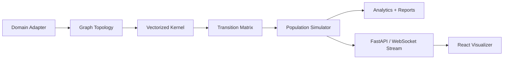

<p align="center">
  
</p>

# Dynamic Kernel

Simulation platform for non-stationary routing over weighted graphs and dynamic topology experiments.

## Summary

Dynamic Kernel is a Python simulation and API platform for studying non-stationary Markov processes over weighted graphs. It combines a vectorized transition kernel, population simulator, domain adapters, FastAPI service, and React/Vite visualizer. The broader research direction uses the system to test dynamic topology evolution ideas while keeping claims tied to versioned scripts, output files, and reports.

## What It Demonstrates

- Vectorized numerical computing with NumPy for transition matrix construction.
- Simulation infrastructure for graph routing, population movement, and domain-specific adapters.
- Backend/frontend integration through FastAPI, WebSockets, and a React/Vite visualizer.
- Research discipline through manifests, reports, falsification scripts, and scoped claim boundaries.
- A self-contained semiconductor policy demo backed by a frozen experiment artifact.

## Architecture

The core kernel computes transition probabilities over graph edges. Domain adapters define topology presets, the simulator moves populations through the graph, the API exposes diagnostics and live streams, and the visualizer makes the dynamics inspectable.



## Installation

Backend:

```bash
python -m venv .venv
.venv/Scripts/activate
pip install -r requirements.txt
uvicorn api:app --reload --port 8000
```

Frontend:

```bash
cd visualizer
npm install
npm run dev
```

## Usage

API examples:

```text
GET  /api/topology
GET  /api/topology/presets
POST /api/topology/load
POST /api/diagnostic
GET  /api/export?format=json
WS   /api/mall/stream
```

Run tests:

```bash
python -m pytest tests/ -v
```

## Evidence

- Core transition computation is vectorized in NumPy.
- Includes multiple domain presets such as mall, airport, museum, and supply chain.
- V1 experiment manifest maps claims to scripts, output artifacts, and required validation.
- Reassessment documents distinguish validated simulation behavior from exploratory theory.
- Semiconductor Policy Lab demo reads from `semiconductor_onshoring_falsification_output.json`.
- Large generated output files are intentionally excluded from this public package.

## Known Limitations

- This is a simulation and research platform, not a validated physical, neural, or economic theory.
- Some generated outputs are large and should be excluded or summarized before public release.
- Several exploratory domains should remain future work unless promoted into a later evidence set.
- The public repository should be cleaned of caches, temporary outputs, local virtual environments, and private scratch files.

## Status

Simulation platform / research systems artifact.
